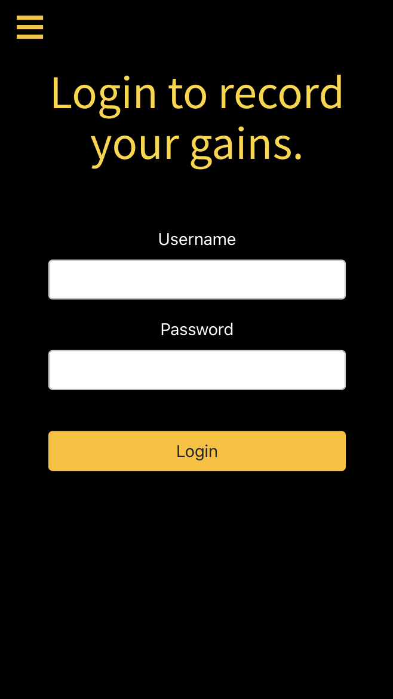

# PB&Jot

Record your personal bests.

Workout tracking app built with React, Node, Express and MongoDB. Designed for mobile.

### Planned MVP features at start of project
- Pre-existing workouts listed on the app for users to choose from.
- User can create account, login and record their personal best for each of the workouts (eg. max bench press at 120kg
on 1 Aug 2020)
- [Not Done] User can create/join groups to share/create/compare workouts records
- [Not Done] User can favourite a workout to have it show on the main page

### Further side feature(s) (Not Done)
- [Done] Barbell weight calculator
- Barbell racking calculator - solve for which plates to put on bar
- Workout timer for HIIT style workouts
- Workout rep counter

### Additional features (Not done)
- User Features
    - Enable editing and/or deleting of user records
    - Profile page with workout stats/analytics
    - Avatars
- Workout Features
    - Enable creation of custom workout to challenge friends
    - Highlight Rx workouts
- Social Features
    - User can create/join groups and add friends to share records/PBs
    - Users can react/comment on others’ records
    - Share on socials - instagram, facebook
    - Group newsfeed (e.g. XXX completed a new workout with a time of 13:49)

### Further Furthers
- Gym owner features for announcing workouts and do scheduling

### Designed for mobile
During the dev process, extra consideration was given to make the app more friendly for mobile users. Larger buttons,
multi-stage registration forms, modals for input. Layout is still passable on desktop.

### Screenshots
<table>
	<tr>
		<td>Landing Page</td>
		<td>Login Page</td>
		<td>Registration</td>
	</tr>
	<tr>
		<td>
			
		</td>
		<td>
			
		</td>
		<td>
			
		</td>
	</tr>

</table>
<table>
	<tr>
		<td>Home Page</td>
		<td>Add New Record Flow</td>
		<td>Barbell Weights Calculator</td>
	</tr>
	<tr>
		<td>
			
		</td>
		<td></td>
		<td></td>
	</tr>

</table>

### Acknowledgements
- My friend and workout buddy Razalee for coming up with the original idea and initial design specs.
- My workout friends for testing the app and providing feedback.
- Everyone at SEI-23, Ebere, Dyana and Jessica.